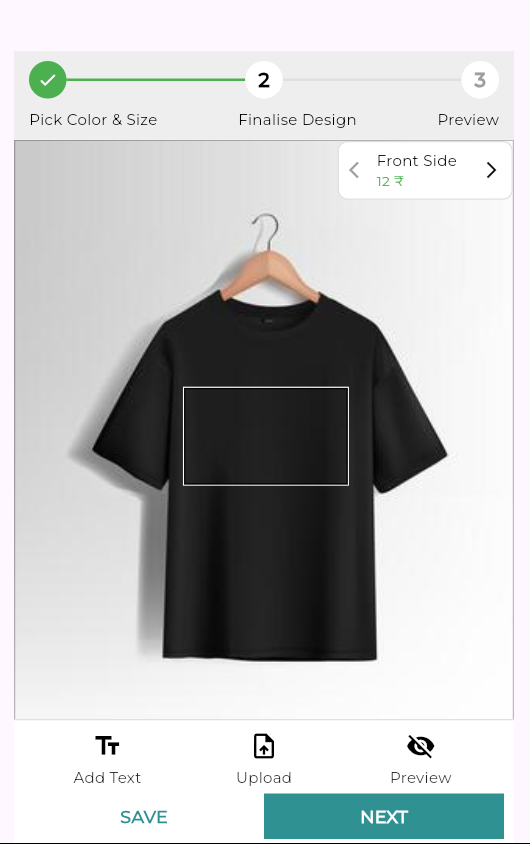
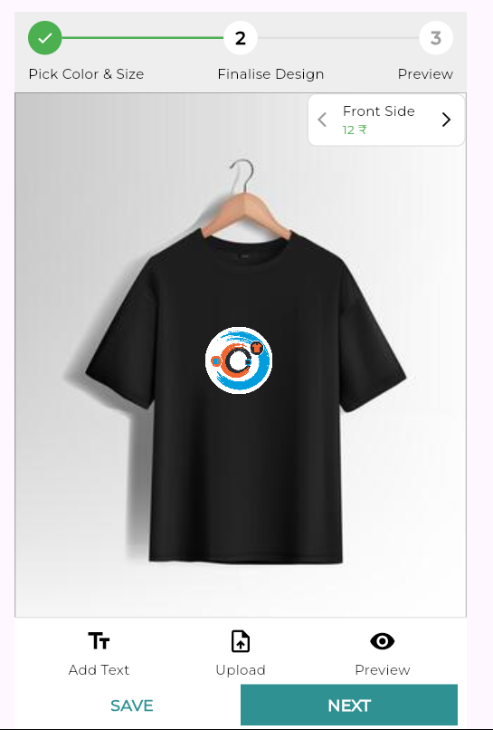
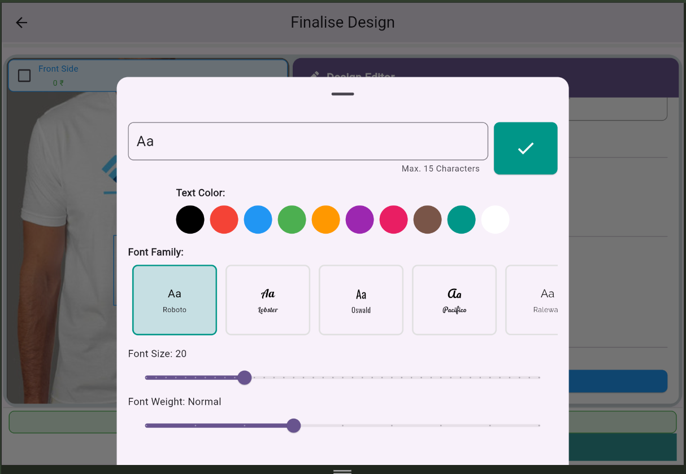
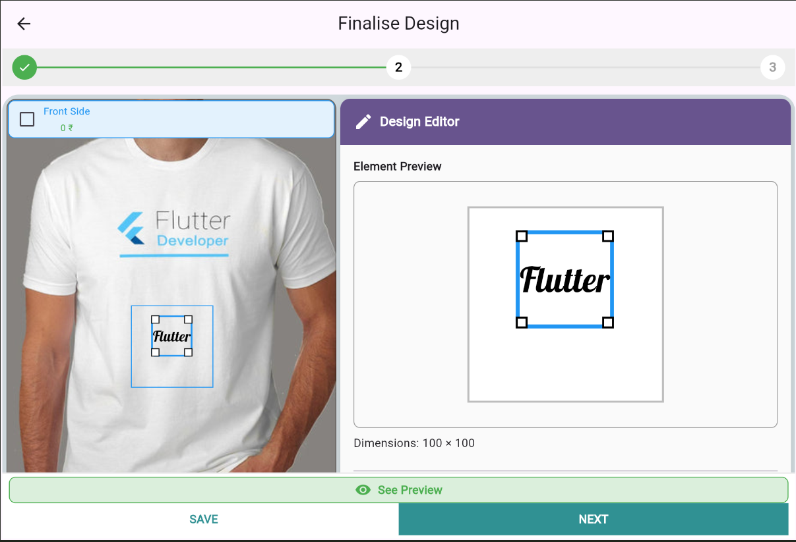
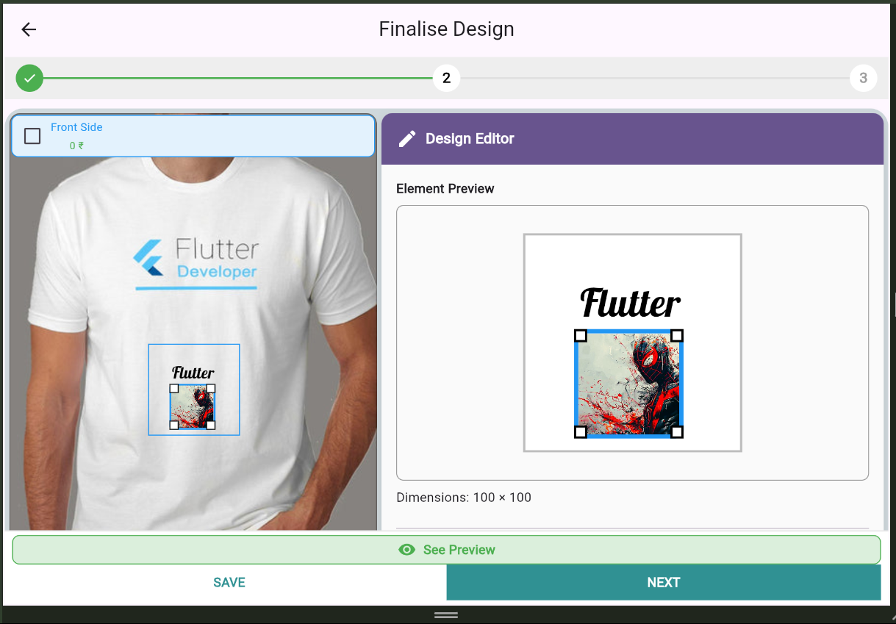

# 📦 product_personaliser

A Flutter package to enable **product personalization**. Easily integrate a dynamic product design editor into your app, allowing users to add **text**, **images**, and other elements to predefined templates — perfect for customizing t-shirts, mugs, posters, and more.

<!--  -->

---

## ✨ Features

- 🎨 Design editor for customizing templates
- 🖼️ Add and position images and text
- 📐 Drag, scale, and rotate elements on canvas
- 🧩 Flexible template system (pages and elements)
- 🧱 Easily embeddable in any Flutter project
- 🌈 Color customization for all elements
- 📤 Export final designs as high-quality images
- 📱 Mobile & web responsive design

## 🌐 Live Demo

Check out the interactive demo: [https://product-personaliser-live-demo.vercel.app/](https://product-personaliser-live-demo.vercel.app/)

## 📦 Installation
1. Add Dependency
Add this to your project's pubspec.yaml file:

1. yaml
dependencies:
  product_personaliser: ^1.0.0  # Check pub.dev for latest version

## 📸 ShowCase

| | |
|--|--|
|  |  |
|  |  |
|  | |
